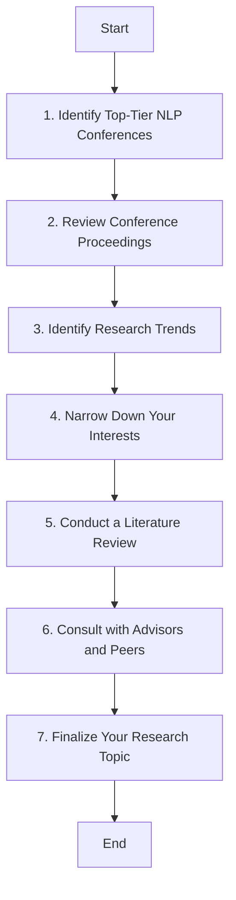

## 📚 Process to select a "Research topic"

**1. Identify Top-Tier NLP Conferences**
Top-tier NLP conferences include:
  -  ACL (Association for Computational Linguistics)
  -  NAACL (North American Chapter of the Association for Computational Linguistics)
  -  EMNLP (Conference on Empirical Methods in Natural Language Processing)
  -  COLING (International Conference on Computational Linguistics)
  -  EACL (European Chapter of the Association for Computational Linguistics)
  -  AAAI (Association for the Advancement of Artificial Intelligence, for its NLP tracks)
  -  NeurIPS (Conference on Neural Information Processing Systems, for its NLP tracks)
    
**2. Review Conference Proceedings**
  -  Access Conference Papers: Visit the conference websites or digital libraries like ACL Anthology, arXiv, or specific conference archives.
  -  Download Proceedings: Get the proceedings of the most recent conference editions.
  -  Read Abstracts and Introductions: Skim through the abstracts and introductions to get a high-level understanding of the topics covered.
    
**3. Identify Research Trends**
  -  Frequent Topics: Look for recurring themes and topics in the papers.
  -  Hot Topics: Identify hot topics by seeing which papers have the most citations or mentions on platforms like Google Scholar, Semantic Scholar, and social media.
  -  Emerging Areas: Pay attention to new and emerging areas that are gaining traction.
    
**4. Narrow Down Your Interests**
  -  Personal Interest: Select topics that personally interest you and align with your career goals.
  -  Relevance and Impact: Consider the practical relevance and potential impact of the research topic in the NLP field and beyond.
  -  Feasibility: Evaluate whether you have the resources (data, tools, expertise) to work on the topic.
 
**5. Conduct a Literature Review**
  -  Deep Dive into Selected Topics: Read key papers thoroughly to understand the methodologies, experiments, results, and conclusions.
  -  Identify Gaps: Look for gaps in the existing research that you could potentially fill with your work.
  -  Review Related Work: Explore the related work sections of papers to find more relevant research and understand the context.
    
**6. Consult with Advisors and Peers**
  -  Seek Feedback: Discuss your selected topics with your academic advisors, mentors, and peers to get feedback and suggestions.
  -  Collaborate: Consider collaborating with others who have expertise or interest in the topic.
    
**7. Finalize Your Research Topic**
  -  Narrow Focus: Narrow down your topic to a specific research question or problem.
  -  Formulate Hypothesis: Formulate a clear research hypothesis or objective.
  -  Plan Your Research: Outline a preliminary research plan, including methodology, data requirements, and potential experiments.

**Example Process**
-  Identify Conferences: ACL, EMNLP.
-  Access Proceedings: Download proceedings from ACL 2023 and EMNLP 2023.
-  Review Abstracts: Skim through abstracts to note trends like transformer models, few-shot learning, and multilingual NLP.
-  Identify Trends: Notice an emerging trend in NLP applications for low-resource languages.
-  Narrow Interests: Interested in multilingual NLP due to background in multiple languages.
-  Literature Review: Read key papers on multilingual NLP and identify a gap in domain adaptation for low-resource languages.
-  Consult Advisors: Discuss the idea with advisors and receive positive feedback.
-  Finalize Topic: Decide on "Domain Adaptation Techniques for Low-Resource Multilingual NLP."
By following these steps, you can systematically select a research topic that is relevant, interesting, and feasible for your work in NLP.

## 📅 Conferences and Community
Stay connected and up-to-date with the latest advancements in AI and LLMs through these platforms:
- Top-tier AI Conferences: Engage with the latest research and discussions at [NeurIPS], ICML, ACL, and other premier AI conferences where groundbreaking ideas are shared and debated.
  - [NeurIPS](https://dblp.uni-trier.de/db/conf/nips/neurips2023.html): Rank A*
  - [ICML](https://dblp.uni-trier.de/db/conf/icml/index.html): Rank A*
  - [ACL](https://dblp.uni-trier.de/db/conf/acl/index.html): Rank A*
  - [AAAI](https://dblp.uni-trier.de/db/conf/aaai/aaai2024.html): Rank A* (divide into multiple tracks like Computer Vision, Education,...)
  - [COLING](https://aclanthology.org/volumes/2024.lrec-main/): Rank B
- Top Tier NLP Conferences List: (https://aclanthology.org/)
- Top Tier Conferences in AI Education:
  - [AIED](https://dblp.uni-trier.de/db/conf/aied/aied2023.html): Rank A
- GitHub and Stack Overflow: Join the community to discuss challenges, share solutions, and advance your knowledge in LLMs. These platforms are ideal for troubleshooting, learning new techniques, and networking with peers.
- Technology Blogs of Leading Corporations</strong>
  - Google AI Blog: Offers insights into Google's latest developments in AI and machine learning, including updates on their work with LLMs. [Visit Google AI Blog](https://ai.googleblog.com/)
  - OpenAI Blog: Provides updates and deep dives into OpenAI's research and applications of LLMs like GPT series. [Visit OpenAI Blog](https://openai.com/blog/)
  - Facebook AI Blog (Meta AI): Features articles on Facebook's advancements in AI research and technology, with a focus on their efforts in NLP and LLMs. [Visit Meta AI Blog](https://ai.facebook.com/blog/)
  - Microsoft AI Blog: Shares developments from Microsoft on their AI technologies, including Azure AI and the latest breakthroughs in language models. [Visit Microsoft AI Blog](https://blogs.microsoft.com/ai/)
- Amazon Science Blog: Provides insights into Amazon's AI innovations, particularly how they leverage LLMs for enhancing customer experiences. [Visit Amazon Science Blog](https://www.amazon.science/)

## Science Database
- Google Scholars: (https://scholar.google.com/)
- Semantics Scholars: (https://www.semanticscholar.org/)
- DBLP: (https://dblp.uni-trier.de/)
- ArXiv: (https://arxiv.org/) -> for booking only, need to verify more

## Conferences / Journals Ranking
- Conference Ranking (CR, AU): (https://portal.core.edu.au/conf-ranks)
- Journal Ranking (JR): (https://www.scimagojr.com/)
  
## :newspaper: SOTA Papers
[1] R. Bommasani et al., “On the Opportunities and Risks of Foundation Models.” arXiv, Jul. 12, 2022. doi: 10.48550/arXiv.2108.07258. [Access here](http://arxiv.org/abs/2108.07258)

## 📚 Books
Dive deep into the foundational theories and practical applications of AI and LLMs with these essential readings:
- "Artificial Intelligence: A Modern Approach" by Stuart Russell and Peter Norvig
  - The definitive textbook on AI, providing a thorough overview of the field and foundational concepts critical to the development of LLMs. [Access here](https://people.engr.tamu.edu/guni/csce421/files/AI_Russell_Norvig.pdf)
- "Deep Learning" by Ian Goodfellow, Yoshua Bengio, and Aaron Courville
  - A fundamental text for those interested in the technical underpinnings of deep learning, essential for understanding how LLMs operate. [Access here](http://alvarestech.com/temp/deep/Deep%20Learning%20by%20Ian%20Goodfellow,%20Yoshua%20Bengio,%20Aaron%20Courville%20(z-lib.org).pdf)
- "Speech and Language Processing" by Daniel Jurafsky, and James H. Martin
  - Offers detailed insights into natural language processing, critical for grasping the linguistic techniques that inform LLM development. [Access here](https://web.stanford.edu/~jurafsky/slp3/)
- "Language Models are Few-Shot Learners" by Tom Brown et al.
  - Explores the capabilities of LLMs in learning from limited data, marking a significant advancement in the field. [Access here](https://papers.nips.cc/paper/2020/hash/1457c0d6bfcb4967418bfb8ac142f64a-Abstract.html)
- "Transformers for Natural Language Processing" by Denis Rothman
  - A vital resource for understanding the Transformers architecture, pivotal in modern LLMs. [Access here](https://github.com/Denis2054/Transformers-for-NLP-and-Computer-Vision-3rd-Edition)

## 📺 Online Courses
Enhance your understanding of LLMs with these expertly curated courses:
-  CS224N: Natural Language Processing with Deep Learning (Stanford University)
  - Introduces deep learning techniques in NLP, foundational for comprehending LLMs. [View course](https://web.stanford.edu/class/cs224n/)
- Deep Learning Specialization by Andrew Ng (Coursera)
  - Starts with neural network basics and advances to sequence models crucial for LLMs. [Enroll here](https://www.coursera.org/specializations/deep-learning)
- Natural Language Processing Specialization (Coursera)
  - Focuses on building and deploying NLP models, offering practical experience with LLMs. [Enroll here](https://www.deeplearning.ai/courses/natural-language-processing-specialization/)
- Generative AI for Beginners (Mirosoft)
  - Learn the fundamentals of building Generative AI applications with our 18-lesson comprehensive course by Microsoft Cloud Advocates. [View course](https://github.com/microsoft/generative-ai-for-beginners/)

## 📺 Youtube 
- Mì AI: (https://www.youtube.com/c/M%C3%ACAIblog)
- Việt Nguyễn AI: (https://www.youtube.com/@vietnh1009)
- The AI Advantage: (https://www.youtube.com/@aiadvantage)
- Two minutes papers: (https://www.youtube.com/@TwoMinutePapers)
- AI Blog: (https://www.youtube.com/@venelin_valkov)
- AI Blog: (https://www.youtube.com/@umarjamilai)
- AI Blog: (https://www.youtube.com/@mreflow)
- AI Explained: (https://www.youtube.com/@aiexplained-official)
- DeepLearningAI: (https://www.youtube.com/@Deeplearningai)

## 🧰 Tools and Libraries
Get hands-on experience with these cutting-edge tools and libraries to apply, fine-tune, and deepen your understanding of LLMs in practice:
- Hugging Face Transformers Library
  - Simplifies the application of LLMs across a range of tasks from text generation to translation. [Explore the library](https://huggingface.co/)
- Unsloth AI
  - Provides a platform for users to fine-tune their language models to better suit specific requirements, enhancing natural language processing capabilities. [Visit Unsloth AI](https://unsloth.ai/)
- Prompting Guide
  - An online resource specializing in the use and development of prompting techniques for LLMs, offering guidance and tips for creating effective prompts. [Explore Prompting Guide](https://www.promptingguide.ai)
- OpenAI API
  - Offers powerful API options to interact with advanced LLMs like GPT-3 and GPT-4, facilitating a range of applications from creative writing to technical problem-solving. [Access OpenAI API](https://beta.openai.com/)"
- Together.xyz API
  - A platform that provides APIs for creating and deploying custom language models, enabling users to build powerful NLP applications with high customization potential. [Visit Together.xyz API](https://api.together.xyz/)
